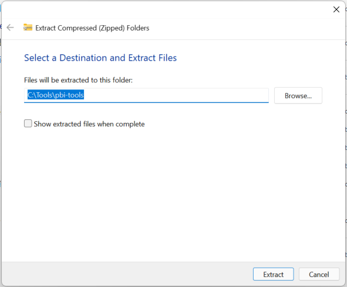

## Assumptions

- You are on a Windows machine with [Power BI Desktop 64-bit installed](https://aka.ms/pbidesktopstore).
- You can download files from <https://github.com>.
- To complete optional steps, you are able to clone a GitHub repository onto your machine.
- Ideally, you have Visual Studio Code installed: <https://code.visualstudio.com/download> _(the "User Installer" does NOT require Admin permissions!)_.

## Installation

`pbi-tools` does (currently) not have an installer. In fact, it does not even need an installer as it is simply a single file which can be run from anywhere.

For the purposes of this tutorial we're assuming that you'll place the tool into `C:\Tools\pbi-tools` and run it from there. If you're choosing to use a different folder, simply replace all references accordingly down below.

### 1. Download the latest release

The latest official release is always available on GitHub at: <https://github.com/pbi-tools/pbi-tools/releases/latest> (at the time of writing the release is "1.0.0-beta.8"). Scroll down to the "Assets" section of the release page and download the file named `pbi-tools.1.0.0-beta.8.zip` (substitute the version number with whatever the latest version is now):

{% include important.html content="The beta.8 release <a href='https://github.com/pbi-tools/pbi-tools/issues/78'>has a bug</a> impacting some non-English machines when extracting from PBIX files with embedded models. Use the tool from <a href='https://github.com/pbi-tools/pbi-tools/releases/tag/1.0.0-beta.9%2B220202'>this new patch release</a> instead which has a bugfix for this." %}

### 2. Unblock the .zip file

By default, Windows blocks files downloaded from the internet, including .zip files, which prevents them from being run. Locate your downloaded file in Windows Explorer, open Properties, and select the "Unblock" box in the bottom right corner. Then confirm with "OK". This process is described in greater detail [on this website](https://singularlabs.com/tips/how-to-unblock-a-zip-file-on-windows-10/).

### 3. Extract the .zip file

Right-click the file and select "Extract All...". Enter the extraction folder (`C:\Tools\pbi-tools` in our case) and confirm.

### 4. Optionally, add the tool folder to your `PATH` environment setting

Since `pbi-tools` is a command-line tool you'll want to be able to run it conveniently from anywhere without having to specify the full path each time. Let's add `C:\Tools\pbi-tools` to the PATH environment variable in your user profile.

Open the Windows Start menu and type "env", the select the option saying "Edit environment variables **for your account**":

Under "User variables" find the "Path" entry, select it, and click "Edit...":

Click "New". A cursor will appear on a new line. Then type in `C:\Tools\pbi-tools` and confirm with "OK".

This has made any executable in that path permanently available to you to be used with the EXE name only, without having to specify the full path!

Let's test this has worked.

### 5. Open a shell and verify the tool runs

Open a new Windows shell from your Start menu (either "Command Prompt", or "Windows Powershell", or the new "Windows Terminal").

Simply type:

    pbi-tools info

This will produce some JSON, confirming the tool version, the tool location as well as any Power BI Desktop installations it was able to detect.

## Using the tool

### 6. Extract a .pbix file

Let try out the `extract` action of `pbi-tools`. To test this, we're using Microsoft's "Adventure Works DW 2020.pbix", available for download here: <https://aka.ms/dax-docs-sample-file>. Again, unblock the file after downloading it, then place it into `C:\pbi-tools-test` (or any other folder of your choice):

In your shell, navigate to `C:\pbi-tools-test`:

    cd C:\pbi-tools-test

Then, use `pbi-tools extract`, specifying the .pbix filename:

    pbi-tools extract '.\Adventure Works DW 2020.pbix'

The tool will run for a few seconds and produce output similar to this:

The `pbi-tools-test` folder now has an additional directory "Adventure Works DW 2020":



Read up on all arguments supported by the `extract` action here: [<i class="fa fa-book"></i>](/cli/usage.html#extract).

### 7. Optionally, view the results in Visual Studio Code

Still in the same shell, launch Visual Studio Code for the current folder:

    code .

Then, navigate through the newly created "Adventure Works DW 2020" folder. You'll find subfolders like "Model" and "Report" and various .json metadata files. For instance, the file at "Model/database.json" contains a section of the tabular model definition, and it will look familiar if you have worked with Tabular Editor or SSMS before.

All contents of the .pbix file - _the model definition, the report pages, embedded resources, and various metadata files_ - have been extracted into a logical folder structure.

## Additional Steps

In addition to extracting sources out of a .pbix file, `pbi-tools` can also **compile sources back into a .pbix file**! Let's do that next.

Since `pbi-tools` only extracts metadata, a data model can only be re-compiled into a .pbit (metadata-only) file and requires a one-off refresh in Power BI Desktop to re-hydrate the model. Microsoft's Adventure Works example we used earlier, however, references data sources which are not publicly available.

For that reason, a special version of the same .pbix is available here: <https://github.com/pbi-tools/adventureworksdw2020-pbix>. That repository contains `pbi-tools` sources for the same model, however, with public data sources instead.

### 8. Clone the AdventureWorks-PBIX demo repository

First, that repository needs to be cloned into the same `C:\pbi-tools-test` folder.

Using the `git` CLI, you can achieve that from within the same shell window as before using this command:

    git clone https://github.com/pbi-tools/adventureworksdw2020-pbix.git

This creates a new subfolder "adventureworksdw2020-pbix":

Inspecting that new folder in Visual Studio Code, you'll find that the "pbix" subfolder has a similar structure to the one we created earlier:

### 9. Compile the sources into a .pbit file

Now we can use the `pbi-tools compile` command to generate a new .pbit from that folder stucture. Still from inside the `C:\pbi-tools-test` folder, run this command:

    pbi-tools compile .\adventureworksdw2020-pbix\pbix -format PBIT -outPath AdvWorksDW2020.pbit

Our folder now has the additional file "AdvWorksDW2020.pbit". Looking at the file size, you can see it is substantially smaller than the .pbix file since it contains no data, only metadata.

Read up on all arguments supported by the `compile` action here: [<i class="fa fa-book"></i>](/cli/usage.html#compile)

### 10. Open the file in Power BI Desktop and load the data

As the final step in this tutorial, let's open that .pbit file in Power BI Desktop.

The data is loaded from CSV files hosted in GitHub instead of SQL Server. Power BI Desktop will bring up a window where the base url is already pre-filled. Simply confirm using the "Load" button:

Next, privacy settings need to be confirmed. In this particular case the default, "Anonymous", is sufficient, so simply proceed by selecting "Connect":

Data load will now kick off:

Eventually, we can confirm on the "Data" tab that the model now actually contains data in each table:

## Summary

What you have achieved in this tutorial:

- Installed `pbi-tools` (Desktop edition).
- Used `pbi-tools extract` to extract sources from a .pbix file into a folder structure.
- Used Visual Studio Code to inspect those sources.
- Used `pbi-tools compile` to create a .pbit file from extracted sources.
- Opened the generated .pbit file with Power BI Desktop to re-hydrate the model.
